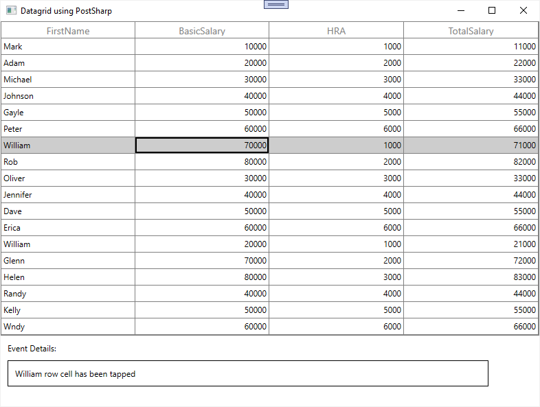

# How to populate Syncfusion WPF controls using PostSharp?

This sample loads [Datagrid](https://help.syncfusion.com/wpf/datagrid/getting-started) with business objects incorporating [NotifyPropertyChanged](https://doc.postsharp.net/inotifypropertychanged-add) and [Command](https://doc.postsharp.net/command) attributes from [PostSharp](https://doc.postsharp.net/).

